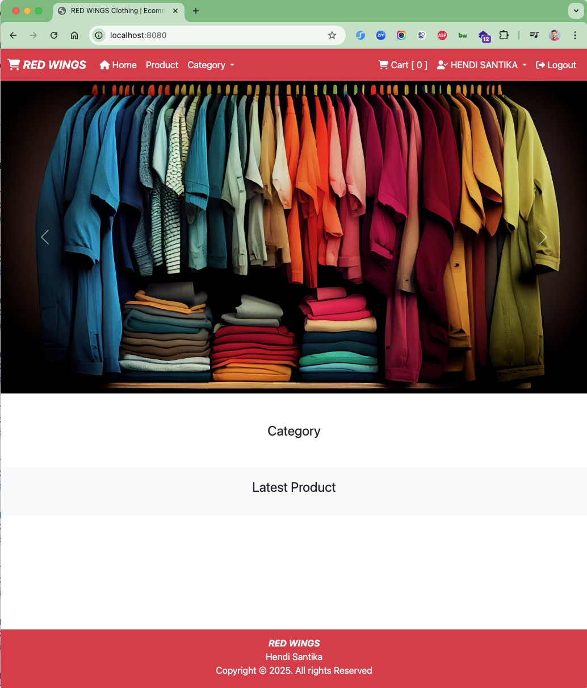
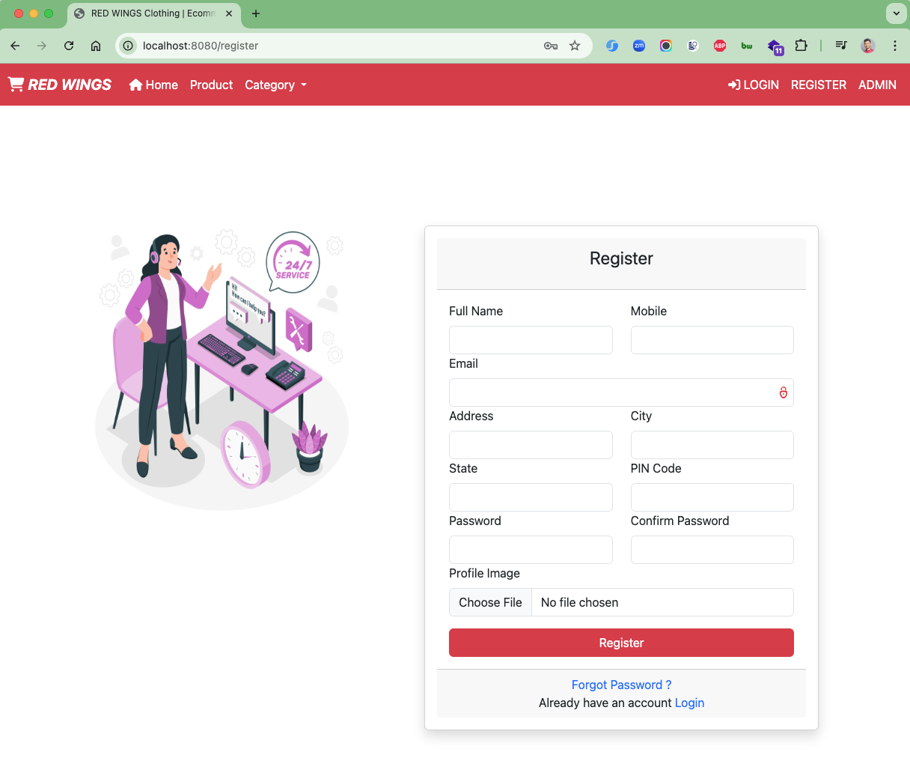
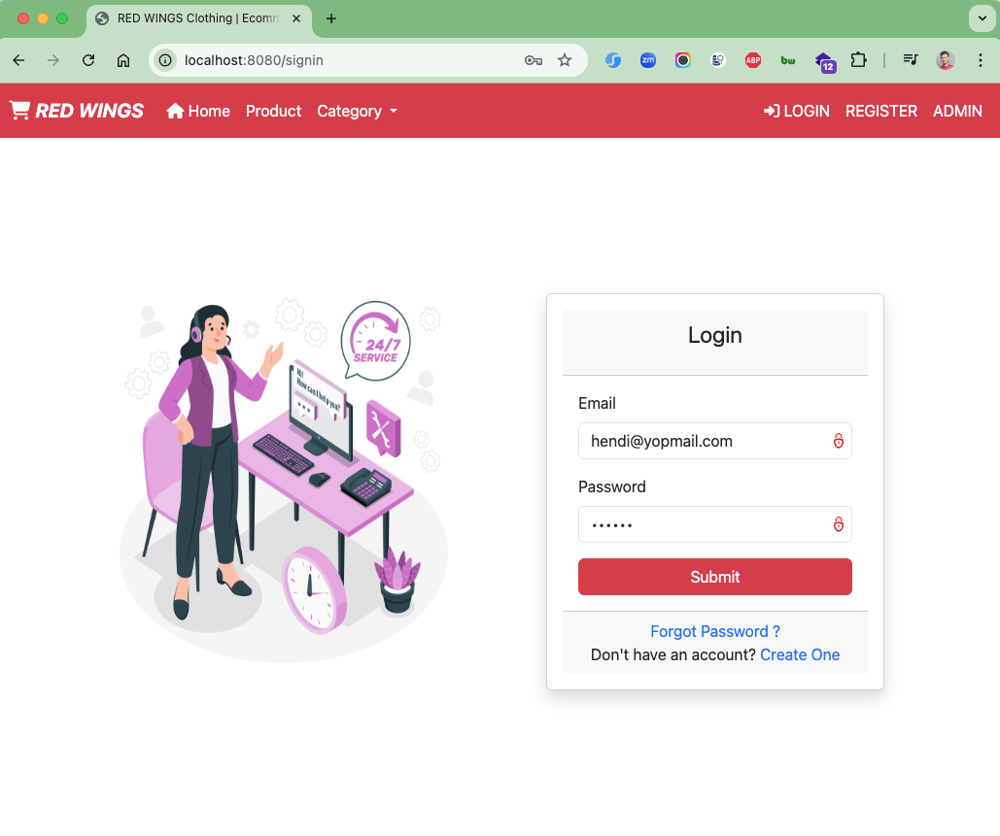
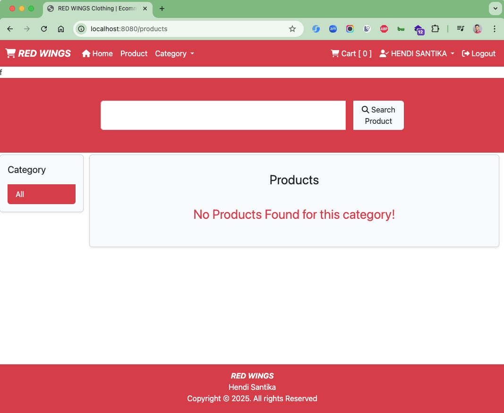
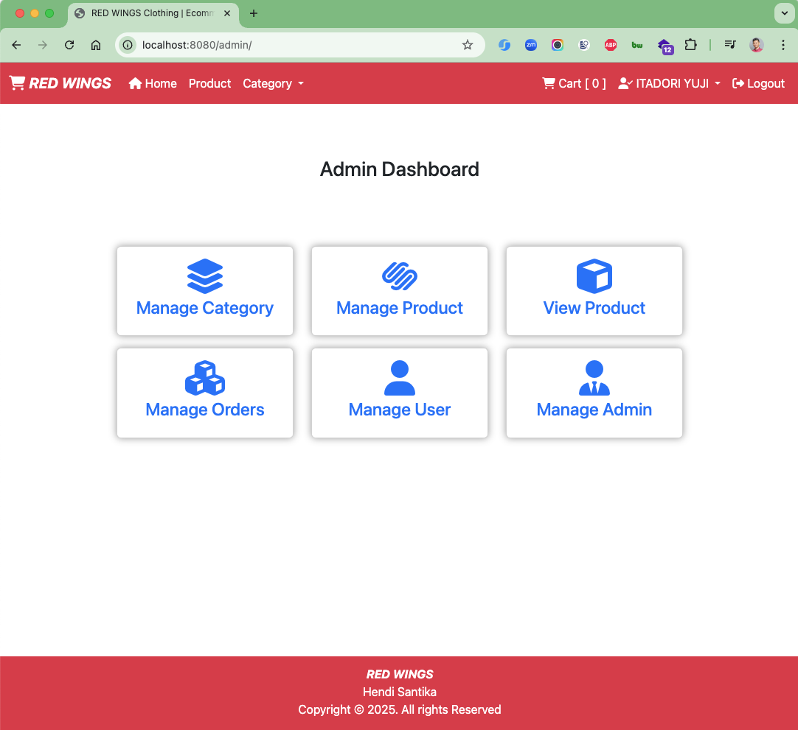

# E-Commerce Application 2

A comprehensive e-commerce web application built with Spring Boot, featuring user authentication, product management,
shopping cart functionality, and order processing.

## 🚀 Features

### User Features

- **User Registration & Authentication** - Secure user registration and login system
- **Product Browsing** - Browse products by categories with detailed product views
- **Shopping Cart** - Add/remove products, update quantities
- **Order Management** - Place orders and track order history
- **User Profile** - Manage user account details

### Admin Features

- **Dashboard** - Admin dashboard with overview statistics
- **Product Management** - Add, edit, delete products with image uploads
- **Category Management** - Manage product categories
- **User Management** - View and manage user accounts
- **Order Management** - Process and track customer orders

## 🛠️ Technology Stack

- **Backend**: Spring Boot 3.5.5
- **Frontend**: Thymeleaf templating engine
- **Database**: MySQL
- **Security**: Spring Security
- **Build Tool**: Maven
- **Java Version**: 21
- **Additional Libraries**:
    - Spring Data JPA
    - Spring Boot DevTools
    - Lombok
    - Commons FileUpload
    - Spring Boot Mail

## 📁 Project Structure

```
src/
├── main/
│   ├── java/id/my/hendisantika/ecommerceapp2/
│   │   ├── config/          # Security and configuration classes
│   │   ├── controller/      # Web controllers
│   │   ├── entity/          # JPA entities
│   │   ├── repository/      # Data repositories
│   │   ├── service/         # Business logic services
│   │   └── util/           # Utility classes
│   └── resources/
│       ├── static/         # CSS, JS, images
│       ├── templates/      # Thymeleaf templates
│       └── application.properties
└── test/                   # Test classes
```

## 🔧 Prerequisites

- Java 21 or higher
- Maven 3.6+
- MySQL 8.0+
- Docker (optional, for containerized deployment)

## 🚀 Getting Started

### 1. Clone the Repository

```bash
git clone <repository-url>
cd ecommerce-app2
```

### 2. Database Setup

1. Create a MySQL database named `ecommerce_app2`
2. Update `src/main/resources/application.properties` with your database credentials:

```properties
spring.application.name=ecommerce-app2
spring.datasource.url=jdbc:mysql://localhost:3306/ecommerce_app2
spring.datasource.username=your_username
spring.datasource.password=your_password
spring.jpa.hibernate.ddl-auto=update
```

### 3. Build and Run

```bash
# Build the project
./mvnw clean compile

# Run the application
./mvnw spring-boot:run
```

The application will be available at `http://localhost:8080`

### 4. Docker Compose (Alternative)

```bash
# Start with Docker Compose
docker-compose up
```

## 📖 API Endpoints

### Public Endpoints

- `GET /` - Home page
- `GET /product` - Product listing
- `GET /product/{id}` - Product details
- `GET /signin` - Login page
- `GET /register` - Registration page

### User Endpoints

- `GET /user/` - User dashboard
- `GET /user/cart` - Shopping cart
- `POST /user/add-to-cart` - Add product to cart
- `GET /user/orders` - Order history

### Admin Endpoints

- `GET /admin/` - Admin dashboard
- `GET /admin/category` - Category management
- `GET /admin/product` - Product management
- `GET /admin/users` - User management

## 🎯 Key Components

### Entities

- **User** - User account information and roles
- **Product** - Product details, pricing, and inventory
- **Category** - Product categorization
- **Cart** - Shopping cart items
- **ProductOrder** - Order information and status
- **OrderAddress** - Delivery address details

### Services

- **UserService** - User management and authentication
- **ProductService** - Product operations
- **CartService** - Shopping cart functionality
- **ProductOrderService** - Order processing
- **CategoryService** - Category management
- **CommonService** - Shared utilities

### Security

- Custom authentication handlers
- Role-based access control (USER/ADMIN)
- Password encryption
- Session management

## 🔧 Configuration

### Security Configuration

The application uses Spring Security with:

- Form-based authentication
- Role-based authorization
- Custom success/failure handlers
- CSRF protection

### File Upload

- Product images are stored in `/static/img/product_image/`
- Category images in `/static/img/category/`
- User profile images in `/static/img/profile_img/`

## 🧪 Testing

```bash
# Run all tests
./mvnw test

# Run with coverage
./mvnw test jacoco:report
```

## 📝 Development Notes

### Adding New Features

1. Create entity classes in the `entity` package
2. Add repository interfaces in the `repository` package
3. Implement business logic in the `service` package
4. Create controllers in the `controller` package
5. Add corresponding Thymeleaf templates

### Database Schema

The application uses JPA with Hibernate for ORM. Entity relationships:

- User ↔ Cart (One-to-Many)
- User ↔ ProductOrder (One-to-Many)
- Product ↔ Category (Many-to-One)
- Product ↔ Cart (Many-to-One)

## 🤝 Contributing

1. Fork the repository
2. Create a feature branch
3. Commit your changes
4. Push to the branch
5. Create a Pull Request

## 📄 License

This project is licensed under the MIT License - see the LICENSE file for details.

## 👥 Author

**Hendi Santika**

- Email: hendi.santika@example.com
- GitHub: [@hendisantika](https://github.com/hendisantika)

## 📞 Support

For support and questions:

- Create an issue in the GitHub repository
- Contact the development team

---

**Note**: This application is part of a learning project demonstrating modern e-commerce application development with
Spring Boot.

### Image Screenshots

Home Page




Register Page



Login Page



Product Details Page



Admin Dashboard

